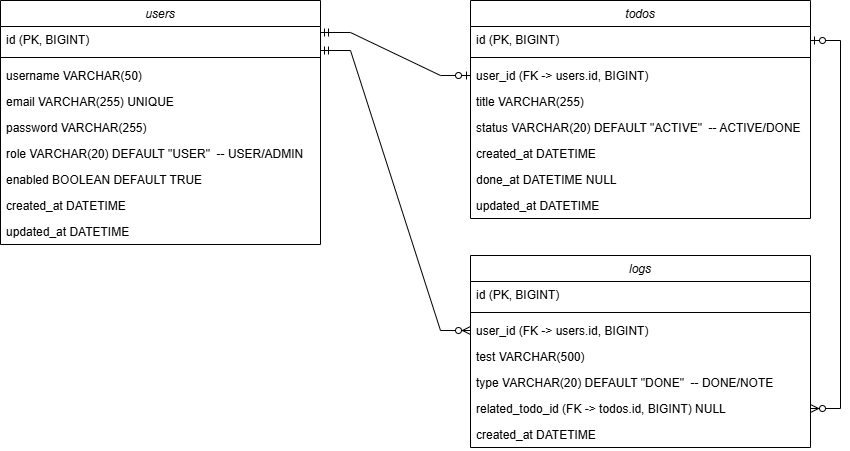

# Growth Log Application (Working Title)

A growth tracking web application built with Spring Boot.

This application allows users to create daily tasks, mark them as completed,
and automatically generate timeline logs to visualize their personal progress
through a structured and relational data design.

The project originally started as a login system and was later extended
into a full task and activity tracking application.

---

## Key Features

### Authentication
- User registration
- Secure login
- Password hashing with BCrypt
- Role-based user structure (USER / ADMIN)

### Todo Management
- Create new tasks
- Mark tasks as DONE
- Automatic completion timestamp
- Task status management (ACTIVE / DONE)

### Timeline Log System
- Automatic log creation when a task is completed
- Manual note posting
- Logs grouped by date
- Optional relation to Todo (nullable foreign key)

### Guest Access
- Users can explore the application without registration.
- A temporary guest session is provided for testing features.
- Guest data is session-based and not persisted in the database.

---

## Tech Stack

- Java 17
- Spring Boot
- MyBatis
- MySQL
- HTML / CSS / JavaScript
- BCrypt

---

## Database Design

### ER Diagram

### Design Decisions

- A user can create multiple todos.
- A log entry is automatically generated when a todo is completed.
- Logs may exist without being linked to a todo.
- All tables use BIGINT primary keys for scalability.
- Foreign key constraints ensure relational integrity.

---

## Deployment Strategy

### Development Environment
- Backend & Frontend: IntelliJ IDEA
- Database Management: DBeaver
- Version Control: Git / GitHub

### Production Deployment (Portfolio Setup)
- EC2 instance hosting Spring Boot application
- MySQL installed on EC2 for cost-efficient deployment

### Production Architecture (Scalable Design)
In a real production environment, the recommended architecture would be:

- EC2 (Application Layer)
- AWS RDS (Managed MySQL Database)
- Separate database instance for improved scalability and reliability

RDS is not currently used to minimize cloud costs during development.

---

## Future Improvements

- React frontend migration
- Streak tracking feature
- Public shareable timeline
- AWS EC2 deployment automation
- REST API documentation (Swagger)

---

## Purpose

This project demonstrates:

- Backend API design
- Authentication implementation
- Relational database design
- Transaction handling
- Deployment strategy planning
- Full-stack integration

---

## Architecture

Controller → Service → Mapper → Database

The application follows a layered architecture:

- Controller: Handles HTTP requests and responses.
- Service: Contains business logic and transaction management.
- Mapper: Communicates with the database using MyBatis.
- Database: Stores relational data with foreign key constraints.

The Service layer ensures atomic operations,
such as updating a Todo and creating a corresponding Log entry.

Transactions are used to guarantee consistency between Todo updates and Log creation.
